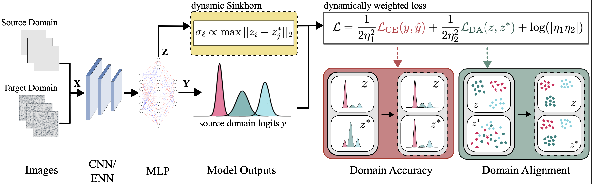

# SIDDA: SInkhorn Dynamic Domain Adaptation for Image Classification

[](https://github.com/snehjp2/GCNNMorphology/blob/main/LICENSE)  
[](https://www.python.org/downloads/release/python-390/)



## Overview

**SInkhorn Dynamic Domain Adaptation (SIDDA)** supplements the experiments presented in *xxxx.xxxx, SIDDA: SInkhorn Dynamic Domain Adaptation for Image Classification with Equivariant Neural Networks*. 

SIDDA introduces a **semi-supervised, automatic domain adaptation method** that leverages Sinkhorn divergences to dynamically adjust the regularization in the optimal transport plan and the weighting between classification and domain adaptation loss terms during training. 

### Key Features:
- **Minimal hyperparameter tuning**: SIDDA utilizes information from the NN latent space geometry to dynamically adjust the OT plan during training.
- **Extensive validation**: Tested on synthetic and real-world datasets, including:
  - Synthetic shapes and astronomical objects generated with [DeepBench](https://github.com/deepskies/DeepBench).
  - The [MNIST-M](https://paperswithcode.com/dataset/mnist-m) dataset.
  - The [Galaxy Zoo Evo](https://huggingface.co/collections/mwalmsley/galaxy-zoo-evo-66532c6c258f5fad31f31880) dataset.
- Compatible with:
  - CNNs implemented in PyTorch.
  - Equivariant Neural Networks (ENNs) using [escnn](https://github.com/QUVA-Lab/escnn).
- **Minimal Computational overhead**: SIDDA is written using PyTorch and [geomloss](https://www.kernel-operations.io/geomloss/), for efficient implementation of Sinkhorn divergences.

### Data Availability
All datasets used in this project are available on our [Zenodo page](https://zenodo.org/uploads/14583107).

---

## Installation

To set up the environment, install the required dependencies using:

```bash
pip install -r requirements.txt
```
or consult appropriate online documentation.

## Code Structure

The repository is organized into the following components:

- **Dataset Handling**:  
  `src/scripts/dataset.py`  
  Contains dataset classes for loading and preprocessing all datasets used in the experiments.

- **Model Definitions**:  
  `src/scripts/models.py`  
  Includes implementations of the CNN and ENN models.

- **Training Scripts**:  
  - `src/scripts/train_CE.py`  
    Standard training with cross-entropy loss only.
  - `src/scripts/train_SIDDA.py`  
    Implementation of the SIDDA training algorithm.

- **Testing Scripts**:  
  - `src/scripts/test.py`  
    Standard model evaluation script.
  - `src/scripts/test_calibrated.py`  
    Script for evaluating model calibration.

- **Configuration Management**:  
  Training and testing are managed via YAML configuration files.  
  An example configuration file for typical training is provided at:  
  `src/scripts/example_yaml_train_CE.yaml`, while an example yaml for SIDDA is provided at `src/scripts/example_yaml_train_SIDDA.yaml`. To train a model, run 

  ```bash
  python train_SIDDA.py --config example_yaml_train_SIDDA.yaml
  ```

After training, the training results are dumped into a directory <save_dir> which can be specified in the yaml file. The outputted directory has the following naming convention: `<savedir_model_(DA)_timestr>`. The directory includes the best-epoch model, final model, loss curve(s) data, $\sigma_\ell$ values, JS distances, and a config.yaml file with numerical specifics (best epoch, best loss, etc.) saved. 

To test the model, run

```bash
python test.py \
--model_path "/path/to/directory/containing/model" \
--x_test_path "/path/to/test/images" \
--y_test_path "/path/to/test/labels" \
--output_name "name for metrics files" \
--model_name "type of model (D_4 or CNN)"
```

The test script will save:
  - a sklearn classification report for all saved models in the directory (`/dir/metrics`)
  - source and target domain latent vectors for each model on the whole test set (`/dir/latent_vectors`). This can later be used to plot isomaps for the models.
  - model predictions for each model over the whole test set (`dir/y_pred`)
  - confusion matrices for each model over the whole test set (`dir/confusion_matrix`)

The calibration test script will further save:
  - calibrated confusion matrices 
  - calibrated probabilities on the whole test set (`dir/calibrated_probs`)
  - Expected calibration error (ECE) and Brier scores (`dir/metrics`)

## Notebooks

- **Exploratory Data Analysis**
  - `src/notebooks/astronomical_objects.ipynb` 
  - `src/notebooks/shapes.ipynb`
  - `src/notebooks/GZ_evo.ipynb`
  - `src/notebooks/mnistm.ipynb`

  These notebooks walk through the data generation procedure for simulated datasets (shapes and astronomical objects), inducing covariate shifts (for shapes, astronomical objects, and MNIST-M), and properly loading the galaxy evo dataset.

## Citation

```bibtex
@misc{}
}
```
